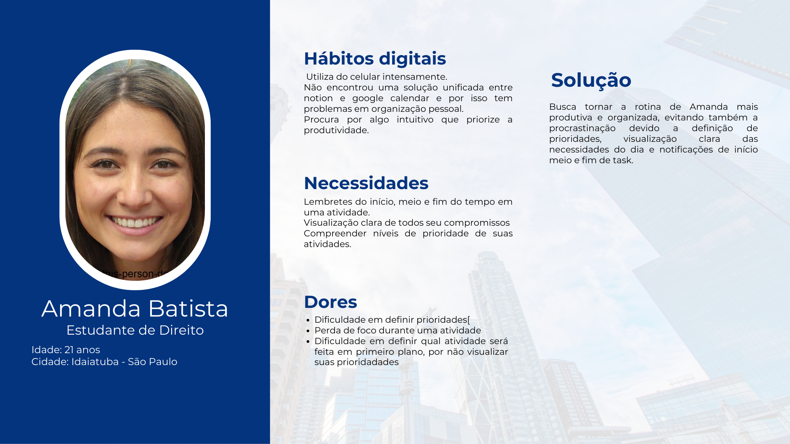

# Web Application Document - Projeto Individual - Módulo 2 - Inteli

**_Os trechos em itálico servem apenas como guia para o preenchimento da seção. Por esse motivo, não devem fazer parte da documentação final._**

## Nome do Projeto

Personal Organizer

#### Autor do projeto

Letícia Fernandes do Espírito Santo Saravia

## Sumário

1. [Introdução](#c1)  
2. [Visão Geral da Aplicação Web](#c2)  
3. [Projeto Técnico da Aplicação Web](#c3)  
4. [Desenvolvimento da Aplicação Web](#c4)  
5. [Referências](#c5)  

 

## 1. Introdução (Semana 01)

Trata-se de um site desenvolvido com o objetivo de facilitar a organização do dia a dia universitário. A plataforma permite ao usuário adicionar e editar tarefas com uma interface intuitiva e acessível, pensada para tornar o usuário mais produtivo. Os dados são integrados pelo próprio estudante.

---

## 2. Visão Geral da Aplicação Web

### 2.1. Personas (Semana 01)

Figura 1 - Persona 
 
Fonte: Material produzido pela autora (2025)

### 2.2. User Stories (Semana 01)

US01
Como estudante de Direito, quero receber lembretes de início, meio e fim de uma atividade, para que eu consiga administrar melhor o meu tempo e não me perder nas tarefas.

US02
Como usuária que busca produtividade, quero visualizar todas as minhas atividades em um calendário intuitivo, para que eu compreenda facilmente meus compromissos e prioridades.

US03 (com análise INVEST)
Como usuária que tem dificuldade em definir prioridades, quero que as tarefas sejam automaticamente classificadas por nível de importância, para que eu saiba em qual atividade focar primeiro.

Análise INVEST de US03:

Independente: Pode ser implementada de forma isolada sem depender de outra funcionalidade.

Negociável: A maneira de classificação manual pelo usuário pode ser adaptada conforme necessidade.

Valiosa: Ajuda Amanda a superar sua maior dor, que é não conseguir definir prioridades, aumentando sua produtividade.

Estimável: A tarefa é de complexidade moderada, possível de estimar para planejamento de sprints.

Pequena: Pode ser dividida em partes menores (ex: definição de critérios de prioridade, exibição no app, etc.).

Testável: É possível testar verificando se as tarefas aparecem ordenadas conforme os critérios definidos.
---

---

## 3. Projeto da Aplicação Web

### 3.1. Modelagem do banco de dados  (Semana 3)

*Posicione aqui os diagramas de modelos relacionais do seu banco de dados, apresentando todos os esquemas de tabelas e suas relações. Utilize texto para complementar suas explicações, se necessário.*

*Posicione também o modelo físico com o Schema do BD (arquivo .sql)*

### 3.1.1 BD e Models (Semana 5)
*Descreva aqui os Models implementados no sistema web*

### 3.2. Arquitetura (Semana 5)

*Posicione aqui o diagrama de arquitetura da sua solução de aplicação web. Atualize sempre que necessário.*

**Instruções para criação do diagrama de arquitetura**  
- **Model**: A camada que lida com a lógica de negócios e interage com o banco de dados.
- **View**: A camada responsável pela interface de usuário.
- **Controller**: A camada que recebe as requisições, processa as ações e atualiza o modelo e a visualização.
  
*Adicione as setas e explicações sobre como os dados fluem entre o Model, Controller e View.*

### 3.3. Wireframes (Semana 03)

Figura 1 - Persona 
 
Fonte: Material produzido pela autora (2025)

Os wireframes desenvolvidos estão alinhados com as funcionalidades descritas nas User Stories pois representam visualmente os principais fluxos de interação da aplicação, garantindo que as demandas do usuário final estejam contempladas desde as etapas iniciais do design.

A User Story 01, que trata da necessidade de receber lembretes de início, meio e fim de uma atividade, está refletida na segunda tela do wireframe. Nela, é exibido um pop-up com a mensagem: “Parabéns, seu tempo de terminar sua atividade acabou! Agora, inicie a fazer...”. Esse elemento reforça o apoio do sistema na gestão de tempo, sinalizando o término da tarefa e incentivando a continuidade do trabalho.

A User Story 02, focada na visualização intuitiva das atividades, foi contemplada com uma estrutura em grade que organiza as tarefas ao longo do tempo. Essa organização facilita a leitura e a compreensão rápida dos compromissos e prazos, oferecendo ao usuário uma experiência semelhante à de um calendário, como solicitado.

Já a User Story 03, relacionada à dificuldade de definição de prioridades, foi incorporada ao layout por meio do campo "Prioridade" no detalhamento das tarefas. Ainda que o wireframe não represente a lógica de priorização automática, ele reserva espaço para essa informação, permitindo que a funcionalidade seja implementada sem comprometer o layout proposto.

### 3.4. Guia de estilos (Semana 05)

*Descreva aqui orientações gerais para o leitor sobre como utilizar os componentes do guia de estilos de sua solução.*

### 3.5. Protótipo de alta fidelidade (Semana 05)

*Posicione aqui algumas imagens demonstrativas de seu protótipo de alta fidelidade e o link para acesso ao protótipo completo (mantenha o link sempre público para visualização).*

### 3.6. WebAPI e endpoints (Semana 05)

*Utilize um link para outra página de documentação contendo a descrição completa de cada endpoint. Ou descreva aqui cada endpoint criado para seu sistema.*  

### 3.7 Interface e Navegação (Semana 07)

*Descreva e ilustre aqui o desenvolvimento do frontend do sistema web, explicando brevemente o que foi entregue em termos de código e sistema. Utilize prints de tela para ilustrar.*

---

## 4. Desenvolvimento da Aplicação Web (Semana 8)

### 4.1 Demonstração do Sistema Web (Semana 8)

*VIDEO: Insira o link do vídeo demonstrativo nesta seção*
*Descreva e ilustre aqui o desenvolvimento do sistema web completo, explicando brevemente o que foi entregue em termos de código e sistema. Utilize prints de tela para ilustrar.*

### 4.2 Conclusões e Trabalhos Futuros (Semana 8)

*Indique pontos fortes e pontos a melhorar de maneira geral.*
*Relacione também quaisquer outras ideias que você tenha para melhorias futuras.*

## 5. Referências

_Incluir as principais referências de seu projeto, para que seu parceiro possa consultar caso ele se interessar em aprofundar. Um exemplo de referência de livro e de site:_ 

---
---
